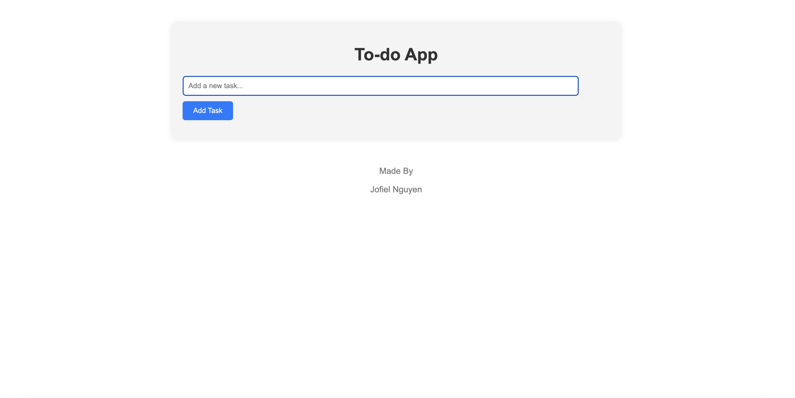

# To-do App

## Description
The To-do App is a simple yet powerful task management application designed to help users keep track of their daily tasks, deadlines, and priorities. With intuitive features and a user-friendly interface, staying organized and productive has never been easier.

## Features
- **Task Management**: Add, edit, and delete tasks effortlessly.
- **Priority Levels**: Assign priority levels to tasks for better organization.
- **Due Dates**: Set due dates and deadlines to stay on track.
- **Search and Filter**: Quickly find tasks using search and filter functionality.
- **Cross-Platform**: Access your tasks from anywhere with cross-platform support.

## Installation
1. Clone the repository: `git clone https://github.com/yourusername/To-do-App.git`
2. Navigate to the project directory: `cd To-do-App`
3. Install dependencies: `npm install` or `yarn install`
4. Start the application: `npm start` or `yarn start`

## Usage
1. Open the application.
2. Create a new task by clicking on the "+" button.
3. Fill in the task details such as title, description, priority, and due date.
4. Click on the "Save" button to add the task.
5. Edit or delete tasks by clicking on the respective icons.
6. Use the search bar to find specific tasks.
7. Filter tasks based on priority or due date.
8. Mark tasks as completed when done.

## Contributing
Contributions are welcome! If you'd like to contribute to the project, please follow these steps:
1. Fork the repository.
2. Create a new branch: `git checkout -b feature/new-feature`
3. Make your changes and commit them: `git commit -am 'Add new feature'`
4. Push to the branch: `git push origin feature/new-feature`
5. Submit a pull request.

## License
This project is licensed under the MIT License - see the [LICENSE](LICENSE) file for details.

## Contact
For any inquiries or support, feel free to contact us at [your-email@example.com](mailto:your-email@example.com).
